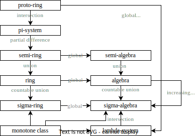

#### Set Systems

##### Properties of set systems

Suppose $X$ is a set. $S \subseteq \P(X)$ is

- **closed under unions** if $A_{1} \cup A_{2} \in S$ whenever $A_{1}, A_{2} \in \S$.
- **closed under intersection** if $A_{1} \cap A_{2} \in \S$ whenever $A_{1}, A_{2} \in \S$.
- **closed under difference** if $A_{1}-A_{2} \in \S$ whenever $A_{1}, A_{2} \in \S$.
- **closed under contained difference** if $A_{1}-A_{2} \in \S$ whenever $A_{1}, A_{2} \in \S$ and $A_1 \supseteq A_2$.
- **partially closed under difference** if for every $A_{1}, A_{2} \in \S$ there exist disjoint sets $B_{1}, B_{2}, \ldots, B_{n}$ in $\S$ such that $A_{1}-A_{2}=\cup_{j=1}^{n} B_{j}$.
- **partially closed under complementation** if for every $A \in \S$ there exist disjoint sets $B_{1}, B_{2}, \ldots, B_{n}$ in $\S$ such that $A^c=\cup_{j=1}^{n} B_{j}$.
- **closed under complementation** if $A^{c} \in \S$ whenever $A \in \S$.
- **closed under countable union** if $\cup_{j=1}^{\infty} A_{j} \in \S$ whenever $\left(A_{j}\right)$ is a sequence in $\S$.
- **closed under disjoint countable union** if $\cup_{j=1}^{\infty} A_{j} \in \S$ whenever $\left(A_{j}\right)$ is a sequence of disjoint sets in $\S$.
- **closed under increasing limit** if $(A_n)_{n = 1}^\infty \in \S$ and $A_n \uparrow A$, then $A \in \S$.
- **closed under decreasing limit** if $(A_n)_{n = 1}^\infty \in \S$ and $A_n \downarrow A$, then $A \in \S$.
- **finitely separable** if any $(A_i)_{i = 1}^n \in \S$, there exists $(B_j)_{j = 1}^m \in \S$ such that $+_j B_j = \cup_i A_i$.
- **countably separable** if any $(A_i)_{i = 1}^\infty \in \S$, there exist $(B_j)_{j = 1}^\infty \in \S$ such that $+_j B_j = \cup_i A_i$.

##### Classes of set systems

A **set system** $\S \subseteq \P(X)$ is classified into following **classes** $\mathscr C\subseteq \P\P(X)$.

- a **proto-ring** if $\S$ contains the empty set.
- a **$\pi$-system** if it is a proto-ring, closed under intersection.
- a **$\lambda$-system** if it is a proto-ring, closed under complementation, and closed under contained difference, and closed under increasing limit.
- a **$\lambda$-system** if it is a proto-ring, closed under complementation, closed under contained difference, and closed under disjoint countable union.
- a **monotone class** if it is closed under increasing and decreasing limits.
- a **semi-ring** if it is a proto-ring, partially closed under difference and closed under intersection.
  - a semi-ring is **countably separable**. Due to the following **separation algorithm**:
    - For any sequence $(B_i)_{i = 1}^\infty \in \S$.
    - Put all $(B_i)$ into the waiting stack $Q$.
    - Construct a component list $C = []$.
    - Repeat the following steps:
      - Pop an element $X$ from the waiting queue.
      - Subtract all sets in $C$ from $X$. Which generates many disjoint pieces $(X_1, \ldots, X_k)$.
      - Add the disjoint pieces to $C$.
    - Now $(C_j)_{j = 1}^\infty$ is a disjoint sequence where $\cup_i B_i = +_j C_j$.
- a **ring** if it is a proto-ring, closed under difference and union.
- a **$\sigma$-ring** if it is a proto-ring, closed under difference and countable unions.
- a **semi-algebra** if it is a proto-ring, partially closed under complementation and closed under intersection.
  - semi-algebras are partially closed under difference.
- an **algebra** if it is a proto-ring, closed under complementation and closed under union.
  - algebras are closed under intersection.
  - algebras are closed under difference.
  - The pair $(X, \S)$ is called a **premeasurable space**.
  - The set $\S$ is called the collection of **premeasurable sets**.
- a **$\sigma$-algebra** if it is a proto-ring, closed under complementation, and closed under countable union.
  - $\sigma$-algebra on $X$ are $\lambda$-system closed under finite union.
    - Suppose $(B_n)_{n = 1}^\infty \in \S$. Define $A_n = B_1 \cup \cdots \cup B_n \in \S$. Define $B = \cup_n B_n$.
    - Then $A_n \uparrow B$. So $B \in \S$, i.e. $\S$ is closed under countable union.
  - $\sigma$-algebras are closed under countable intersection.
  - $\sigma$-algebras are closed under difference.
  - The pair $(X, \S)$ is called a **measurable space**.
  - The set $\S$ is called the collection of **measurable sets**.

The results are summarized in the following diagram.

#### Generated Set Systems

> The minimum $\lambda$-system of a $\pi$-system inside an $\lambda$-system is a $\sigma$-algebra.
>
> Consider the monotone class generated by $\E$. Suppose the monotone class contains complements and intersections of $\E$, it is a $\sigma$-algebra.
>
> Finite unions of sets in a semi-ring forms a ring.
>
> Countable unions of sets in a semi-ring forms a $\sigma$-ring.

##### Generated set systems

Consider set systems on set $X$.

The intersection of two rings, $\sigma$-rings, algebras, monotone classes, $\sigma$-algebras, $\pi$-systems and $\lambda$-systems form a new system of the same class.

- This is **not** true for semi-rings and semi-algebras.
- The intersection of all systems in class $\mathscr C$ that contains $\E \subseteq \P(X)$ is called the system **generated** by $\E$.
  - The generated system is denoted by $\mathscr C(\E)$.
  - $\E$ is called the generator of $\mathscr C(\E)$.

##### $\lambda - \pi$ theorem

Consider set systems on set $X$.

If $\mathcal{P}$ is a $\pi$-system and $\mathcal{L}$ is a $\lambda$-system. Suppose $\P \subseteq \L$. Then $\lambda(\P)$ is a $\pi$-system.

- For $A \in \lambda(\P)$, define $\G_A := \{B\in \lambda(\P): A \cap B \in \lambda(\P)\} \subseteq \lambda(\P)$.
  - $\G_A$ is a $\lambda$-system:
    - $X \in \G_A$.
      - Since $A \cap X = A \in \lambda(\P)$.
    - If $B, C \in \G_A$ and $B \supseteq C$, then $B - C \in \G_A$.
      - Since $A \cap (B - C) = A \cap B - A \cap C \in \lambda(\P)$.
    - If $(B_n)_{n = 1}^\infty \in \G_A$ and $B_n \uparrow B$, then $B \in \G_A$.
      - Since $A \cap B_n \in \lambda(\P)$, $A \cap B_n \uparrow A \cap B$.
  - For $A \in \lambda(\P)$, $\G_A = \lambda(\P)$.
    - For $A \in \P$, clearly $\G_A \supseteq \P$. Then $\G_A \supseteq \lambda(\P)$. So $\G_A = \lambda(\P)$.
    - Then $\forall A \in \P, \forall B \in \lambda(\P): A \cap B \in \lambda(\P)$.
    - For $A \in \lambda(\P)$, clearly $\G_A \supseteq \P$. Then $\G_A \supseteq \lambda(\P)$. So $\G_A = \lambda(\P)$.

Immediately we have $\sigma(\P) = \lambda(\P) \subseteq \L$.

- Notice that $\lambda(\P) \subseteq \lambda(\L) = \L$.

##### Monotone class theorem

> Reference: https://almostsuremath.com/2019/10/06/the-monotone-class-theorem/

Suppose nonempty $\E \in \P(X)$ where for all $A, B \in \E$, $A^c \in \mathup M(\E)$ and $A \cap B \in \mathup M(\E)$.

Then $\sigma(\E) = \mathup M(\E)$.

- $\mathup M(\E) \subseteq \sigma(\E)$ is apparent. We only need to show that $\mathup M(\E)$ is an algebra.
- $\mathup M(\E)$ is closed under complement.
  - Let $\F$ be the subset of $\mathup M(\E)$ where $A \in \F$ implies $A^c \in \mathup M(\E)$.
  - $\E \subseteq \F$ by assumptions.
  - $\F$ is a monotone class. So $\F \supseteq \mathup M(\E)$.
    - Suppose $\p{A_n} \subseteq \F$ is increasing, $\cup A_n \in \F$.
      - $\p{A_n^c}$ is decreasing. $\cap A_n^c \in \mathup M(\E)$.
    - Suppose $\p{A_n} \subseteq \F$ is decreasing, $\cap A_n \in \F$.
      - $\p{A_n^c}$ is increasing. $\cup A_n^c \in \mathup M(\E)$.
- $\mathup M(\E)$ is closed under intersection.
  - For any $A \in \mathup M(\E)$. Let $\F_A$ be the subset of $\mathup M(\E)$ where $B \in \F$ implies $A \cap B \in \mathup M(\E)$.
    - $\F_A$ is a monotone class.
      - Suppose $\p{B_n} \subseteq \F_A$ is increasing. Apparently $\cup B_n \in \F_A$. Since
        $$
        A \cap \p{\cup B_n} = \cup \p{A \cap B_n} \in \mathup M(\E)
        $$
      - Similarly for any $\p{B_n} \subseteq \F_A$ decreasing.
  - For $A \in \E$, $\F_A = \mathup M(\E)$.
    - $\E \subseteq \F_A$ by assumptions.
  - For $A \in \mathup M(\E)$, $\F_A = \mathup M(\E)$.
    - $\E \subseteq \F_A$ due to previous result.

A stronger assumption would be $\E$ is an algebra.

##### Predicate on generated systems

Consider generated set system $\mathscr C(\E)$ on $X$.

To show $\forall E \in \mathscr C(\E): P(E)$ for some predicate $P$. We have the following general procedure:

- Consider $\G := \{S \in \mathscr C(\E): P(S)\} \subseteq \mathscr C(\E)$.
- Show that $\E \subseteq \G$. And $\G$ obeys the axioms of class $\mathscr C$.

##### Restricted set systems

For a set system $\A\subseteq \P(X)$, the **restriction** of $\A$ to $Y \subseteq X$ is $\A|_Y := \{Y \cap B: B \in \A\}$.
- For all mentioned classes, the restriction gives a new system in the same class.

##### Semi-ring $\to$ ring

Suppose $\S$ is a **semi-ring** on $X$.

Define $\overline \S$ as the set of all **finite disjoint unions** of sets in $\S$.

Then $\overline \S$ is the ring generated by $\S$.

- $\overline \S$ is a semi-ring. And $\overline \S$ is closed under union.

Suppose $\S$ is a **semi-algebra**, then $\overline \S = \A(\S)$.

Suppose $\overline \S$ contains $X$, then $\overline \S = \A(\S)$.

##### Semi-ring $\to$ $\sigma$-ring

Suppose $\S$ is a **semi-ring** on $X$.

Define $\widetilde \S$ as the set of all **countable disjoint unions** of sets in $\S$.

Then $\widetilde \S$ is the $\sigma$-ring generated by $\S$.

- $\widetilde \S$ is closed under countable union.
- $\widetilde \S$ is closed under difference.
  - Suppose $A = +_n A_n \in \widetilde \S$ and $B = +_n B_n \in \widetilde \S$.
  - Consider $C_i = B - A_i$. Clearly $B - A = \cup C_i$.
  - We claim that $C_i \in \widetilde \S$.
    - Construct sequence $\p{A_i, B_1, B_2, \ldots}$.
    - Now apply separation algorithm. And drop the first $A_i$.

Suppose $\S$ is a **semi-algebra**, then $\widetilde \S = \S_\sigma = \sigma(\S)$.

Suppose $\widetilde \S$ contains $X$, then $\widetilde \S = \S_\sigma = \sigma(\S)$.
