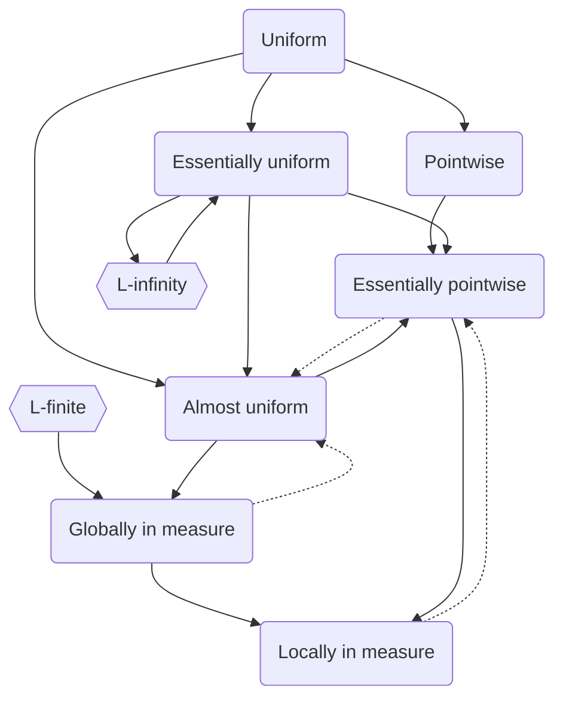

#### Function Sequences

##### The ring of finite measure

Suppose $(\Omega, \A, \mu)$ is a measure space.

- Define $\A^<: =\{A \in \A: \mu(A) < \infty\}$. Clearly $\A^<$ is a **ring** on $\Omega$.

##### Markov inequality

Suppose $(\Omega, \A, \mu)$ is a measure space. Suppose $f \in \L(\Omega \to [0, \infty))$.

Now we warp the values of $f$ by increasing $\theta: [0, \infty) \to [0, \infty)$. Suppose $\mu[\theta(f)]$ exists.

- Then for any $\epsilon > 0$:
  $$
  \mu[\theta(f)] \ge \mu[\theta(f)1_{\theta(f) \ge \theta(\epsilon)}] \ge \mu[\theta(\epsilon)1_{\theta(f) \ge \theta(\epsilon)}] = \theta(\epsilon)\mu\{f \ge \epsilon\}
  $$
- Let $\theta(x) = x^p$ for $p \in (0, \infty)$. And $f \in \L^p(\Omega \to [0, \infty])$. Then $\epsilon^p \mu\{f \ge \epsilon\} \le \mu f^p$.
  - Apply to $\L^p$ space, this gives $\mu\{|f| \ge \epsilon\} \le \epsilon^{-p} \|f\|_p^p$.

##### Continuity of metric

Suppose $(E, d)$ is a **(extended) metric space**. $d(x, y): E^2 \to [0, \infty]$ is a continuous function.

- $E^2$ is equipped with the product metric.
- $d$ is continuous iff for all sequence $\p{x_n, y_n} \to (x, y)$ in $E^2$, $d(x_n, y_n) \to d(x, y)$.
- When $d(x, y) < \infty$.
  - $d(x_n, y_n) \le d(x_n, x) + d(x, y) + d(y, y_n)$.
  - So $|d(x_n, y_n) - d(x, y)| \le d(x_n, x) + d(y_n, y) \le d((x_n, y_n), (x, y))$.
  - So $d(x_n, y_n) \to d(x, y)$.
- When $d(x, y) = \infty$. $d(x_n, y_n) \to \infty$.

Suppose $f, g \in \L(\Omega \to E, \A)$.

- Then $\omega \mapsto (f(\omega), g(\omega)) \in \L(\Omega \to E^2, \A/\B(E^2))$.
- Since $d: \L(E^2 \to [0, \infty], \B(E^2))$
- So $H(\omega) = d(f(\omega), g(\omega)) \in \L(\Omega \to [0, \infty], \A)$.

##### Uniformly bounded

Suppose $\p{f_n}_{n=1}^\infty: \Omega \to E$ where $E$ is a **metric space**.

$\p{f_n}$ is **uniformly bounded** if $\diam \cup_n f_n[\Omega] < \infty$.

##### Basic modes of convergence

Suppose $f, \p{f_n}_{n=1}^\infty: \Omega \to E$ where $E$ is a **metric space**.

1. (**Pointwise**) $f_n$ converge to $f$ pointwise on $X \subseteq \Omega$, denoted as $f_n \to_X f$.
2. (**Uniform**) $\forall \epsilon > 0, \exists N \in \Z, \forall n \ge N, \forall x \in X: d(f_n(x), f(x)) < \epsilon$.
   - Denoted by $f_n \rightrightarrows_X f$, $f_n$ converge to $f$ uniformly on $X$.
   - $f_n \rightrightarrows_X f$ then $f_n \to_X f$.

Let $X$ be a topological space. Let $M$ be a metric space. Let $f_n: X \to M$ and $f: X \to M$.

Suppose $\Omega$ is a topological space. And $X \subseteq \Omega$.

3. (**Locally uniform**) $f_n$ converge to $f$ locally uniformly if $\forall x \in X, \exists U \in N(x): f_n \rightrightarrows_U f$.
4. (**Bounded uniform**) $f_n$ converges **bounded uniformly** to $f$ on $X$ if $\forall E \in \P_{\operatorname{bounded}}(X): f_n \rightrightarrows_E f$.
   - Bounded uniformly convergence implies locally uniformly convergence.

##### Limit of uniformly continuous functions

Suppose $S$ is a **topological space**. And $f, \p{f_n}_{n=1}^\infty: S \to E$ where $E$ is a **metric space**. 

Suppose $f_n \rightrightarrows_S f$. And $f_n$ are continuous at $c \in S$, then $f$ is continuous at $c \in S$.

- Consider any $\epsilon > 0$.
- There exists $N$ where for all $n \ge N$ we have $d(f_n(x), f(x)) < \epsilon / 3$.
- Now pick any $n \ge N$. There exists open neighborhood $O$ of $c$ where $f_n(O) \subseteq B(f_n(c), \epsilon / 3)$.
- For any $x \in O$, consider chain $f(x) \to f_n(x) \to f_n(c) \to f(c)$, each link has error at most $\epsilon / 3$.

$$
\lim _{x \to c} \lim _{n \to \infty} f_{n}(x)=\lim _{n \to \infty} \lim _{x \to c} f_{n}(x)
$$

##### Cauchy condition for uniform convergence

Suppose $\p{f_n}_{n=1}^\infty: S \to E$ where $E$ is a **complete metric space**.

Then $f_n \rightrightarrows_S f$ to some $f: S \to E$ if and only if
$$
\forall \epsilon > 0, \exists N \in \Z, \forall x \in S, \forall m, n > N: d(f_m(x), f_n(x)) < \epsilon
$$

#### Function Series

##### Function series

Suppose $\p{f_n}_{n=1}^\infty: S \to E$ where $E$ is a **normed space** over $\bF$.

Define the partial sum on $S$ as $s_n(x) = \sum_{k=1}^n f_k(x)$.

- Suppose $s_n \to_S f$, series $\sum f_n$ is convergent on $S$. Denoted as $\sum f_n \to_S f$.
- Suppose $s_n \rightrightarrows_S f$, series $\sum f_n$ is uniformly convergent on $S$. Denoted as $\sum f_n \rightrightarrows_S f$.

##### Weierstrass M-test for uniform convergence

Suppose $\p{f_n}_{n=1}^\infty: S \to E$ where $E$ is a **normed space** over $\bF$.

Then $\sum f_k$ converges uniformly on $S$. If

- $M_n > 0$ and $\sum M_n$ converges.
- And $\forall n \in \N, \forall x\in S: 0 \le \n{f_n(x)} \le M_n$.

##### Dirichlet's Test for Series

 

- Suppose $f_n: S \subseteq \R \to \C$, suppose $F_n(x) = \sum_{k=1}^n f_k(x)$.
- Suppose $F_n$ is uniformly bounded on $S$.
- Suppose $g_n : S \to [0, \infty)$. $g_{n+1}(x) \le g_n(x)$.
- Suppose $g_n \rightrightarrows 0$ on $S$.

Then $\sum f_n(x) g_n(x)$ converges uniformly on $S$.

##### Abel's Test for Series

- Suppose $f_n: S \subseteq \R \to \C$, suppose $F_n(x) = \sum_{k=1}^n f_k(x)$.
- Suppose $F_n$ is uniformly convergent on $S$.
- Suppose $g_n: S \subseteq \R \to \R$, $g_{n+1}(x) \le g_n(x)$.
- Suppose $g_n$ is uniformly bounded on $S$.

Then $\sum f_n(x) g_n(x)$ converges uniformly on $S$. 

#### More Modes of Convergence

##### Modes of convergence

Suppose $(\Omega, \A, \mu)$ is a **measure space**. And $f, (f_n)_{n = 1}^\infty \in \L(\Omega \to E)$.

3. (**Essentially pointwise**) $f_n \to f$ $\mu$-a.e. if $f_n \to_{\Omega \backslash N} f$ where $\mu(N) = 0$.
   - $f_n \to f$ $\mu$-a.e. then $f_n \to f$ in $\mu$ locally (see below).
     - Suppose $A \in \A^<$. And $\epsilon > 0$.
     - Define $D_{n, \epsilon}: \{\omega \in A: \exists m > n: d(f, f_m) > \epsilon\}$.
     - $\mu_A\{d(f, f_n) > \epsilon\} \le \mu_A(D_{n, \epsilon}) \to 0$. So $\mu\{d(f, f_n) > \epsilon\} \to 0$.
4. (**Essentially uniform**) $f_n \rightrightarrows f$ $\mu$-a.e. if $f_n\rightrightarrows_{\Omega \backslash N} f$ where $\mu (N) = 0$.
5. (**Almost uniform**) $f_n \rightrightarrows f$ in $\mu$ if $\forall \epsilon > 0, \exists E_\epsilon \in \A: \mu(E_\epsilon) \le \epsilon \land f_n \rightrightarrows_{\Omega \backslash E_\epsilon} f$.
   - $f_n \rightrightarrows f$ in $\mu$ then $f_n \to f$ in $\mu$ globally.
     - Suppose $f_n \to f$ in $\mu$ globally is false. $\exists \epsilon > 0: \mu\{d(f, f_n) > \epsilon\} \not \to 0$.
     - $\exists \delta > 0, \forall N \in \N, \exists n > N: \mu\{d(f, f_n) > \epsilon\} > \delta$.
     - By $f_n \rightrightarrows f$ in $\mu$, $\exists E_\delta \in \A: \mu(E_\delta) \le \delta \land f_n \rightrightarrows_{\Omega - E_\delta} f$.
     - So $\exists N_\delta \in \N, \forall n > N: \mu\{d(f, f_n) > \epsilon\} \le \delta$. Contradiction!
   - $f_n \rightrightarrows f$ in $\mu$ then $f_n \to f$ $\mu$-a.e.
     - $E = \cap_{n = 1}^\infty E_{1/n}$. Then $f_n \to_{\Omega \backslash E} f$. And $\mu E = 0$.
6. (**Locally in measure**) $f_n \to f$ in $\mu$ if $\forall A \in \A^<,\forall \epsilon > 0: \mu_A\{d(f, f_n) > \epsilon\} \to 0$.
7. (**Globally in measure**) $f_n \to f$ in $\mu$ **globally** if $\forall \epsilon > 0: \mu\{d(f, f_n) > \epsilon\} \to 0$.
   - $f_n \to f$ in $\mu$ globally then $f_n \to f$ in $\mu$ locally.
   - Suppose $\mu$ is finite, then $f_n \to f$ in $\mu$ **globally iff locally**.

Suppose $f, g, (f_n)_{n = 1}^\infty \in \L^p(\Omega \to \mathbf F, \mu)$ where $p \in (0, \infty]$.

8. (**In $\L_p$ norm**) $f_n \to f$ in $\L_p$ if $\|f_n - f\|_p \to 0$.
   - $f_n \to f$ in $\L_p$ then $\mu f_n \to \mu f$.
     - Since $|\mu f_n - \mu f| \le \mu |f_n - f| \to 0$.
   - $f_n \to f$ in $\L_\infty$ **iff** $f_n \rightrightarrows f$ $\mu$-a.e.
   - $f_n \to f$ in $\L_p$ then $f_n \to f$ in $\mu$ globally.
     - For $p < \infty$, by (**Markov**) $\mu\{|f_n - f| \ge \epsilon\} \le \epsilon^{-p}\|f_n - f\|_p^p \to 0$.

##### Counter-examples

- (**Escape to horizontal infinity**) $f_n = 1_{[n, n + 1]}$. $f_n \to 0$ ($\mu$.a.e.) but not in any other modes.
- (**Escape to width infinity**) $f_n = 1_{[0, n]}/n$. $f_n \to 0$ in all modes but $\L_1$ norm.
- (**Escape to vertical infinity**) $f_n = n 1_{[1/n, 2/n]}$.
  - $f_n \to 0$ pointwise, and almost uniformly.
  - Not converge uniformly or in any norm.
- (**Typewriter sequence**) $f_n = 1_{[(n - 2^k)/2^k, (n - 2^k + 1)/2^k]}$.
  - $f_n \to 0$ in $\mu$ globally and in finite-norm.
  - Not converge pointwise $\mu$.a.e. or almost uniformly.

##### Egorov's Theorem

Suppose $(\Omega, \A, \mu)$ is a **finite** measure space. Suppose $(E, d)$ is a metric space.

Suppose $(f_n)_{n = 1}^\infty \in \L(\Omega \to E)$ and $f_n \to f$ $\mu$-a.e. then $f_n \rightrightarrows f$ in $\mu$.

- For $N, m \in \N^+$ define $E_{N, m} = \{x \in X: \exists n \ge N: f_n(x) \notin B(f(x), 1/m)\} \in \A$.
- Since $f_n \to f$ $\mu$-a.e. then $\mu (\cap_{N=1}^\infty E_{N, m}) = 0$. So $\lim_{N \to \infty} \mu(E_{N, m}) = 0$.
- For any $m$ there is a $N_m$ where $\mu(E_{N_m, m}) < \epsilon/2^m$. 
- $\forall m \in \N^+, \exists N_m \in \N^+: \mu(E_{N_m, m}) < \epsilon / 2^m$. Let $E_\epsilon = \cup_{m=1}^\infty E_{N_m, m}$. $\mu E_\epsilon < \epsilon$.
- Clearly $f_n \rightrightarrows_{\Omega\backslash E_\epsilon} f$.

#### Convergence in Measure

##### Convergence in measure *locally*

Suppose $(\Omega, \A, \mu)$ is a **$\sigma$-finite measure space**, $E$ is a **metric space**. Let $f, (f_n)_{n = 1}^\infty \in \L(\Omega \to E)$.

- (**Fast I**) Suppose $\forall \epsilon > 0, \forall A \in \A^<:\sum_{n = 1}^\infty \mu_A(\{d(f, f_n) > \epsilon\}) < \infty$. Then $f_n \to f$ $\mu$-a.e.
    - Suppose $A \in \A^<$. Let $B_{n, \epsilon} = A \cap \{d(f, f_n) > \epsilon\}$ and $B_{\epsilon} = \limsup_n B_{n,\epsilon}$.
    - Then $\mu_A(B_\epsilon) = 0$ by (**Cantelli**).
    - Define $N = \cup_n B_{1/n}$, $\mu(N) = 0$, and $f_n \to f$ on $A \backslash N$.
- Since $\mu$ is $\sigma$-finite, repeat above process on each patch of $\Omega$.
- (**Fast II**) Suppose $E$ is **complete**. Suppose $(\epsilon_n)_{n = 1}^\infty > 0$, $\sum_n \epsilon_n < \infty$. And $\forall A \in \A^<: \sum_{n = 1}^\infty \mu_A\{d(f_n, f_{n + 1}) > \epsilon_n\} <\infty$. Then $f_n \to f$ $\mu$-a.e. for some $f \in \L(\Omega \to E)$.
    - Now prove in $(A, \A|_A, \mu_A)$.
    - Let $B_n = \{d(f_n, f_{n + 1}) > \epsilon_n\}$ and $B = \limsup_n B_n$.
    - Since $\sum_n \mu B_n < \infty$, $\mu_A(B) = 0$ by (**Cantelli**).
    - For $\omega \in A \backslash B$, $d(f_n, f_{n + 1}) > \epsilon_n$ finitely many times. Now $f_n(\omega)$ is Cauchy in $E$ on $A \backslash B$.
    - So for $f_n \to f$ $\mu$-a.e. on $A$.
- (**Metric of convergence**) There is a **metric** $\tilde d$ on $\L(\Omega \to E)$, s.t. $f_n \to f$ in $\mu$ **iff** $\tilde d(f, f_n) \to 0$.
    - Suppose $(A_N)_{N = 1}^\infty \in \A^<$ where $A_N\uparrow \Omega$.
    - Define $\tilde d_N(f,g) = \mu\min(1_{A_N}, d(f, g))$.
    - Define $\tilde d(f, g) = \sum_N \tilde d_N (f, g)2 ^{-N}/(1 + \mu A_N)$.
    - Now $0 \le \tilde d_N(f, g) \le \mu A_N$ and $0\le \tilde d(f, g) \le 1$.
    - It is easy to verify that $\tilde d$ is indeed a **metric** on $\L(\Omega \to E, \A)$.
    - For $f, (f_n)_{n = 1}^\infty \in \L(\Omega \to E, \A)$, $f_n \to f$ in $\mu$ if and only if $\tilde d(f, f_n) \to 0$.
        - $\tilde d(f, f_n) \to 0$ if and only if $\forall N \ge 1: \tilde d_N(f, f_n) \to 0$.
        - $\tilde d_N(f, f_n) \to 0$ if and only if $\forall \epsilon > 0:\mu(\{d(f, f_n) > \epsilon\} \cap A_N) \to 0$.
- (**Subsequence**) $f_n \to f$ in $\mu$ if and only if for any subsequence $(f_{k})$ of $(f_n)$, there is a subsequence $(f_m)$ such that $f_m \to f$ $\mu$-a.e. ^in-measure-subsequence
    - $\to$ direction: Pick $(f_l) \subset (f_m)$ such that $\mu(A_l \cap \{d(f, f_l) > 1/l\}) < 2^{-l}$.(**Fast I**).
    - $\leftarrow$ direction: Prove the contrapositive. Conside the metric space $(\L(\Omega \to E), \tilde d)$.
- (**Cauchy**) $(f_n)$ is **Cauchy** in $\mu$ if $\forall A \in \A^<,\forall \epsilon > 0: \lim_{m, n \to \infty}\mu_A\{d(f_m, f_n) > \epsilon\} = 0$.
- (**Completeness, TODO**) $(f_n)$ is Cauchy in $\mu$ then $f_n \to f$ in $\mu$ for some $f \in \L(\Omega \to E)$.

##### Convergence in measure globally

Let $(E, d)$ be a metric sapce. And $(\Omega, \A, \mu)$ is a measure space. Suppose $f, (f_n)_{n = 1}^\infty \in \L(\Omega \to E)$.

- (**Cauchy**) $(f_n)$ is **Cauchy** in $\mu$ globally if $\forall \epsilon > 0: \lim_{m, n \to \infty} \mu\{d(f_n, f_m) > \epsilon\} = 0$.
  - If $f_n \to f$ in $\mu$ then $(f_n)$ is Cauchy in $\mu$.
- (**Subsequence**) ==TODO== $f_n \to f$ in $\mu$ globally, then there exists $(f_k) \subset (f_n)$ where $f_k \rightrightarrows f$ in $\mu$.
  - See Ash. pp.97 for the proof.

#### Convergence in Norm

##### Convergence in norm

Suppose $(\Omega, \A, \mu)$ is a measure space. Suppose $f, (f_n)_{n = 1}^\infty \in \L^p(\Omega \to \R, \mu)$ for $p \in (0, \infty)$.

- (**Fast III**) Suppose $\mu$ is **$\sigma$-finite**. $\sum_{n = 1}^\infty \|f_n - f\|^p_p < \infty$. Then $f_n \to f$ $\mu$-a.e.
  - By (**Markov**) $\mu(\{|f-f_{n}|>\varepsilon\}) \leq \varepsilon^{-p}\|f-f_{n}\|_{p}^{p}$. Now apply (**Fast I**).

Suppose $p \in [1, \infty)$. $L^p$ is a **Banach space**.

- (**Cauchy**) $(f_n)$ is called **Cauchy in $\L_p$** if $\lim_{m, n \to \infty} \|f_n - f_m\|_p = 0$.
    - $(f_n)$ is Cauchy in $\L_p$ then $(f_n)$ is Cauchy in $\mu$. (Hint: by converse).
    - $f_n \to f$ in $\L_p$ then $(f_n)$ is Cauchy in $\L_p$.
- (**Fast IV**) Suppose $\|f_k - f_{k + 1}\|_p < 4^{-k}$. Then $f_n \to f$ $\mu$-a.e. to some $f \in \L(\Omega \to \R)$.
    - Let $A_k = \{|f_k - f_{k + 1}| \ge 2^{-k}\}$. By (**Markov**) $\mu A_k \le 2^{-kp}$.
    - By (**Cantelli**) $\mu A^* = 0$, so $f_k(\omega)$ is cauchy $\mu$-a.e.
    - So $f_n$ converges to some $f \in \L(\Omega \to \R)$.
- (**Completeness**) $(f_n)$ is Cauchy in $\L_p$ then $f_n \to f$ in $\L_p$ norm to some $f \in \L^p(\Omega \to \R)$.
    - Pick $(f_{n_k}) \subset (f_n)$ according to (**Fast IV**), then $f_{n_k} \to f$ $\mu$-a.e. for some $f \in \L(\Omega \to \R)$.
    - $\forall \epsilon > 0, \exists N \in \N: \forall n, m \ge N: \|f_n - f_m\|_p^p < \epsilon$.
    - $\liminf_{k \to \infty} \|f_n - f_{n_k}\|_p^p = \liminf_{k \to \infty} \mu |f_n - f_{n_k}|^p \ge \mu \liminf_{k \to \infty} \mu|f_n -f|^p = \|f_n - f\|_p^p$
    - So $\|f_n - f\|_p \to 0$. So $f \in \L^p(\Omega \to \R)$.

Suppose $p = \infty$. $\L^\infty$ is a **Banach space**.
- (**Completeness**) $\L^\infty$ is a Banach space.
    - Since $\bF$ is complete, Cauchy essentially pointwise implies essentially uniform convergence.
    - Essentially uniform convergence if and only if convergence in $\L^\infty$.
- (**Completeness**) $(f_n)$ is Cauchy in $\L_\infty$ iff $f_n \to f$ in $\L_\infty$ norm for some $f \in \L^\infty (\Omega \to \R)$.
  - Since $\|f_n - f_m\|_\infty \to 0$ as $n, m \to \infty$.
  - $\forall \epsilon > 0, \exists N \in \N, \forall n, m > N, \forall x \in A: |f_n(x) - f_m(x)| \le \epsilon$. Where $\mu(A^c) = 0$.
  - So $f_n \to f$ $\mu$-a.e. for some $f \in \L(\Omega \to \R)$.
  - The convergence is uniform on $A$ since $\lim_{m \to \infty} |f_n(x) - f(x)| \le \epsilon$.
  - So $f \in \L^\infty(\Omega \to \R)$.

#### Uniqueness of Convergence

##### Implication diagram

Notice that L-finite and L-infinity are only defined for codomain $\mathbf F$ is $\R$ or $\C$.

##### Convergence in $\mathbf F$

Suppose $(\Omega, \A, \mu)$ is a measure space. And $\mathbf F = \R, \C$, $c \in \bF$.

Suppose $(f_n)_{n = 1}^\infty, (g_n)_{n = 1}^\infty, f, g \in \L(\Omega \to \mathbf F)$. All convergence modes are well defined. Then

- $f_n \to f$ in any mode if and only if $|f_n - f| \to 0$ in any mode.
- $f_n \to f$ and $g_n \to g$ in some mode then $f_n + g_n \to f + g$ and $cf_n \to cf$ in the same mode.
- $f_n \to 0$ in some mode and $\forall n \in \N^+: |g_n| \le f_n$ then $g_n \to 0$ in the same mode.

##### Uniqueness of convergence

Suppose $(\Omega, \A, \mu)$ is a measure space and $(E, d)$ is a metric space.

Suppose $(f_n)_{n = 1}^\infty, (g_n)_{n = 1}^\infty, f, g \in \L(\Omega \to E, \A/\B(E))$.

- When $\mu$ is **$\sigma$-finite**. $f_n \to f$ in $\mu$ locally and $f_n \to g$ in $\mu$ locally implies $f = g$ $\mu$.a.e.
  - $\mu_A\{d(f, g) > \epsilon \} \le \mu_A\{d(f, f_n) > \epsilon / 2\} + \mu_A\{d(g, f_n) > \epsilon / 2\} \to 0$.
  - So $\mu(\{d(f, g) > 0\}) = 0$ by union of each region.
- $f_n \to f$ in $\mu$ globally and $f_n \to g$ gloablly implies $f = g$ $\mu$.a.e.
  - The proof is similar to the above one.
- $f_n \to f$ $\mu$.a.e. and $f_n \to g$ $\mu$.a.e. implies $f = g$ $\mu$.a.e. (Apparently.)
- $f_n \to g$ in $\mu$ globally and $f_n \to f$ $\mu$.a.e. implies $f = g$ $\mu$.a.e.
  - Prove by contradiction, suppose $A = \{d(f, g) \neq 0\}$ is not a null set.
  - Exists $\epsilon > 0$ where $\mu\{d(f, g) > \epsilon\} = c > 0$.
  - $\mu\{d(f_n, g) > \epsilon\} \to 0$. But since $d(f_n, g) + d(f_n, f) \ge d(f, g)$.
  - So $\mu\{d(f, g) > \epsilon\} \le \mu\{d(f_n, g) > \epsilon / 2\} + \mu\{d(f_n, f) > \epsilon / 2\} \to 0$. Contradiction!

##### Corollary of DCT

Suppose $(f_n)_{n = 1}^\infty \in \L^p(X \to \eR, \mu)$ where $p \in (0, \infty]$, and $f \in \L^p(X \to \eR)$.

Suppose $f_n \to f$ $\mu$-a.e. and for $g \in \L^p(X \to [0, \infty], \mu)$, $|f_n| \le g$. Then $\mu |f_n - f|^p \to 0$.

- $|f_n - f|^p \le (|f_n| + |f|)^p \le (2|g|)^p$. And $|f_n - f|^p \downarrow 0$.
- By (**DCT**) $\mu |f_n - f|^p \to 0$ (or $f_n \to f$ in $\L^p$).

