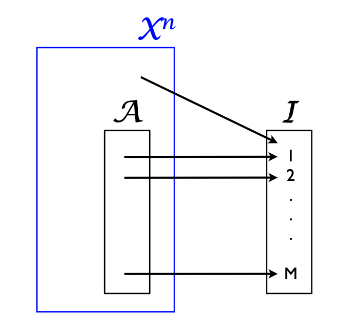
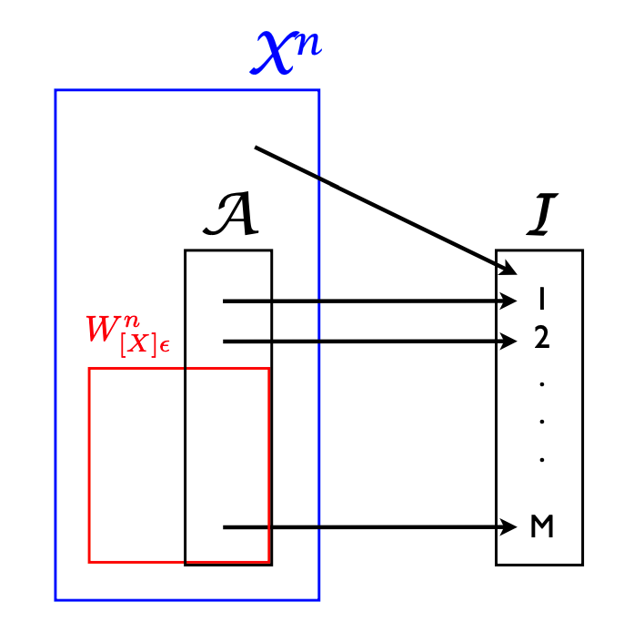

#### Weak AEP

##### Convergence in probability

 Suppose $X_n, n \ge 0$ and $Y$ are real random variables on $(\Omega, \mathcal F, P)$. The following are equivalent:

1. $\forall \epsilon > 0: \lim_{n \to \infty} P(|X_n - Y| < \epsilon) = 1$.
2. $\forall \epsilon > 0: \lim_{n \to \infty} P(|X_n - Y| < \epsilon) > 1 - \epsilon$.
3. $\forall \epsilon > 0: \lim_{n \to \infty} P(|X_n - Y| \le \epsilon) = 1$.
4. $\forall \epsilon > 0: \lim_{n \to \infty} P(|X_n - Y| \le \epsilon) > 1 - \epsilon$.

Clearly $1 \to 2$, $3 \to 4$, $2 \to 4$, $1 \to 3$. Now we show $4 \to 1$. Suppose $1$ is wrong:
$$
(\neg 1) \quad \exists \epsilon > 0, \exists \delta > 0, \forall N, \exists n \ge N: P(|X_n - Y| < \epsilon) \le 1 - \delta
$$
Take $\gamma = \min(\epsilon, \delta)$. Then $4$ is wrong:
$$
(\neg 4)\quad \forall N, \exists n \ge N: P(|X_n - Y| < \gamma) \le 1 - \gamma\\
$$
This is denoted by $X_n \to Y$ **in probability**.

> Convergence in distribution -- Center limit theorem.
> Convergence in probability -- Weak law of large numbers.
> Convergence in probability 1 -- Strong law of large numbers.

##### Review: Weak law of large numbers

 Suppose $(\Omega, \mathcal F, P)$ is a probability space and $X, X_k, k \in \N^+$ are i.i.d. random variables.

Suppose $EX = \mu \in \R$ and $\operatorname{Var}X = \sigma^2 \in (0, \infty)$. Then
$$
E\left(\frac{1}{n} \sum_{k=1}^{n} X_{k}\right)=\mu; \quad \operatorname{Var}\left(\frac{1}{n} \sum_{k=1}^{n} X_{k}\right)=\frac{1}{n^{2}} \operatorname{Var}\left(\sum_{k=1}^{n} X_{k}\right)=\frac{\sigma^{2}}{n} > 0;
$$
Recall: Chebyshev's inequality:
$$
\forall t > 0: P(|X-E X| \geq t \sigma(X)) \leq \frac{1}{t^{2}}
$$
Let $t = \sqrt n \epsilon / \sigma$ then:
$$
P\left(\left|\left(\frac{1}{n} \sum_{k=1}^{n} X_{k}\right)-\mu\right| \geq \varepsilon\right) \leq \frac{\sigma^{2}}{n \varepsilon^{2}}
$$
Now let $n \to \infty$. we have:
$$
\forall \epsilon > 0: \lim _{n \rightarrow \infty} P\left(\left|\left(\frac{1}{n} \sum_{k=1}^{n} X_{k}\right)-\mu\right| \geq \varepsilon\right)=0
$$
or $\sum_{k = 1}^n X_k \to \mu$ **in probability**.

##### Weak typical set

 Suppose $X_n, n \ge 1$ are i.i.d. random variables with countable support $\mathcal X$ on probability space $(\Omega, \mathcal F, P)$.

Denote $\mathcal X^{n}$ as the n-dimensional product set, $X^{(n)}$ is the random vector $(X_1, \cdots, X_n)$. And $x^{(n)} \in \mathcal X^{n}$ is a sample.

Then $-\log p(X_n), n \ge 1$ are also i.i.d. random variables, assume that $-\log p(X) \in \mathcal L^2(P)$. Apply the weak law of large numbers:
$$
\frac{-\sum_{k=1}^n\log p(X_k)}{n} = \frac{-\log p(X_1, \cdots, X_n)}{n} = \frac{-\log p(X^{(n)})}{n} \to H(X)\quad  \text{in probability}
$$
The **weakly typical set** $W_{X, \epsilon}^n \subseteq \mathcal X^{(n)}$ is defined as:
$$
W_{X, \epsilon}^n := \left \{x^{(n)} \in \mathcal X^n: \left|\frac{-\log p(x^{(n)})}{n} - H(X)\right| \le \epsilon \right\}
$$
**Clearly $P(X^{(n)} \in W_{X, \epsilon}^n) \to 1$ as $n \to \infty$.** 

Or equivalently defined as the set with approximately the same probability...
$$
W_{X, \epsilon}^n = \left \{
x^{(n)} \in \mathcal X^{(n)}: D^{-n (H(X) + \epsilon)} \le p(x^{(n)}) \le D^{-n(H(X) - \epsilon)}
\right \}
$$
**Or $p(x^{(n)}) \approx D^{-nH(X)}$ for $x^{(n)} \in W_{X, \epsilon}^n$.**

To get some idea about the size of $W_{X, \epsilon}^n$, observe:
$$
\forall \delta > 0, \exists N, \forall n > N:(1 - \delta)D^{n(H(X) - \epsilon)} \le |W_{X, \epsilon}^n| \le D^{n(H(X) + \epsilon)}
$$
Further suppose $\mathcal X$ is finite:
$$
H_D(X) < \log_D |\mathcal X| - \epsilon \implies \lim_{n \to \infty}\frac{D^{n(H(X) + \epsilon)}}{|\mathcal X|^n} = \lim_{n \to \infty}\frac{D^{n(H(X) + \epsilon)}}{D^{n \log_D |\mathcal X|}} = D^{n(H(X) - \log |\mathcal X| + \epsilon)} \to 0
$$
**When $X$ is not so much uniform and $H(X) \not \approx \log|\mathcal X|$, $|W_{X, \epsilon}^n| / |\mathcal X^n| \to 0$.**

#### The Source Coding Theorem

##### Block code

 Suppose the **alphabet** $\mathcal X$ is countable. 

Suppose $X, X_n, n \ge 0$ are i.i.d. random variables with **support** on $\mathcal X$.

A **finite** set $\mathcal I = \{1, \cdots, M\}$ is called an **index set**.

A function $C: \mathcal X^n \to \mathcal I$ is called an **encoder**.

A function $D: \mathcal I \to \mathcal X^n$ is called a **decoder**. The tuple $(C, D, \mathcal I)$ is called a **block code**.
$$
X^{(n)} \stackrel{\text{enc}}{\longrightarrow} C(X^{(n)}) \stackrel{\text{dec}}{\longrightarrow} \widehat X^{(n)} = D \circ C(X^{(n)})
$$

- $n$ is the **block length** of the block code.
- $R = \log |\mathcal I| / n \text{ bits}$ is the **(coding) rate** of the block code in **bits per source symbol**.
  - When $|\mathcal I| = |\mathcal X|^n$, $R = \log |\mathcal X|$. In general $R < \log |\mathcal X|$ for data **compression**.
- $p_e = P(\widehat X^{(n)} \neq X^{(n)})$ is the **error probability** of **block code** $(C, D, \mathcal I)$.

##### Shannon's source coding theorem I

 Continue above discussion. Suppose $X \in \mathcal L^2(P)$.

Fix $\epsilon > 0$. Consider the set $\mathcal A = W_{X, \epsilon}^n$, then:

- Define $\mathcal I$ = $\{1, \cdots, |W_{X, \epsilon}^n|\}$. 
- Define $C: \mathcal X^n \to \mathcal I$ to exactly encode elements in $W_{X, \epsilon}^n$ and encode all other elements to $1 \in \mathcal I$. 
- Define $D: \mathcal I \to \mathcal X^n$ to exactly decode elements in $W_{X, \epsilon}^n$ and decode all other elements arbirartarily. 

The coding rate is guaranteed to be in range $H(X) \pm \epsilon$.
$$
\forall \delta > 0 ,\exists N, \forall n > N: \frac{\log(1 - \delta)}{n} + (H(X) - \epsilon) \le  \frac{\log|W_{X, \epsilon}^n|}{n} \le (H(X) + \epsilon)
$$
Fix $\epsilon > 0$. For large enough $n$, the coding error goes down to zero.
$$
\lim_{n \to \infty} p^{(n)}_e =  \lim_{n \to \infty}P(X^{(n)} \notin W_{X, \epsilon}^n) = 0
$$
##### Shannon's source coding theorem II

 Continue above discussion. Suppose $X \in \mathcal L^2(P)$.

Fix $\zeta > 0$. Consider the **set** $\mathcal C_n$ of all (deterministic) block code $(C, D, \mathcal I)$ of block length $n$ and rate **less than** $H(X) - \epsilon$ on alphabet $\mathcal X$. Clearly $|\mathcal I| < |\mathcal X|^n$.

Each $(C, D, \mathcal I) \in \mathcal C_n$ gives a nonnegative error probability $p_e(C, D, \mathcal I)$. Define the **optimal error rate**:
$$
p_e^*(\mathcal C_n):= \inf \{ p_e(C, D, \mathcal I): (C, D, \mathcal I) \in \mathcal C_n\}
$$
We want to show that $\lim_{n \to \infty} p_e^*(\mathcal C_n) = 1$.

Suppose $(C, D, \mathcal I)$ is in $\mathcal C_n$:

- Suppose $D$ is not an injective function, and $D(i) = D(j) = a$. By redefine $D(i)$ and $D(j)$ to max probability elements in $C^{-1}(i), C^{-1}(j)$. This gives a better block code.
- Suppose $C$ is not an surjective function. Then making $C$ surjective gives a better block code.

Define the set of all block codes in $\mathcal C_n$ with a **surjective encoder and injective decoder** as $\mathcal E_n$.
$$
p_e^*(\mathcal C_n) = p_e^*(\mathcal E_n)
$$
So we only need to show $\lim_{n \to \infty} p_e^*(\mathcal E_n) = 1$.

For all $\zeta > \epsilon > 0$, there exists $N$, for all $n > N$: $P(X^{(n)} \in W_{X, \epsilon}^n) > 1 - \epsilon$ and $D^{-n(\zeta - \epsilon)} < \epsilon$.

For any $n > N$, for any $(C, D, \mathcal I) \in \mathcal E_n$.

- Define $D[I] = \mathcal A$ as shown in the figure above.
  $$
  \frac{\log |\mathcal I|}{n} < H(X) - \zeta \iff |\mathcal I| = |\mathcal A| < D^{n (H(X) - \zeta)}
  $$

- $P(X^{(n)} \in W_{X, \epsilon}^n \cap \mathcal A) \le D^{n(H(X) - \epsilon)} D^{-n(H(X) - \zeta)} = D^{-n(\zeta - \epsilon)}$.

- $P(X^{(n)} \in \overline {W_{X, \epsilon}^n}) \le \epsilon$.

- $p_e = P(X^{(n)} \notin \mathcal A) \ge P(X^{(n)} \in W_{X, \epsilon}^n \backslash \mathcal A) \ge 1 - (D^{-n(\zeta - \epsilon)} + \epsilon) \ge 1 - 2 \epsilon$.

In summary, we have proved the following:
$$
\forall \epsilon \in (0, \zeta), \exists N, \forall n > N, \forall (C, D, \mathcal I) \in \mathcal E_n: p_e(C, D, \mathcal I) \ge 1 - 2 \epsilon
$$
This is exactly the desired result:
$$
\forall \epsilon \in (0, \zeta), \exists N, \forall n > N: p_e^*(\mathcal C_n) \ge 1 - 2\epsilon \iff \lim_{n \to \infty} p_e^* (\mathcal C_n) = 1
$$

#### Strong AEP

##### Strongly typical set

Suppose alphabet $\mathcal X$ is ***finite***. Suppose $X, X_n, n \ge 1$ are i.i.d. r.v.s. on $(\Omega, \mathcal F, P)$ with image in $\mathcal X$. 

Suppose $p(x)$ is the PMF of $X$. Suppose $\mathcal S_X$ is the subset of $\mathcal X$ where $p(x) > 0$.

Denote $\mathcal X^n$ as the n-dimensional product set, $X^{(n)}$ is the random vector $(X_1, \cdots, X_n)$. And $x^{(n)} \in \mathcal X^n$ is a sample. We also abuse the notation and use $P$ and $p$ as the probability measure and PMF of $\mathcal X^n$ and $X^{(n)}$.

Define counting function $N(x; x^{(n)}): \mathcal X \times \mathcal X^n \to \N$ as:
$$
N(x; x^{(n)}):= \sum_{i = 1}^n 1(x = x^{(n)}_i)
$$

- $n^{-1} N(x; x^{(n)})$ is the relative frequency of $x$ in $x^{(n)}$.
- $q(x) = \{n^{-1} N(x; x^{(n)})\}$ is the emperical distribution of $x^{(n)}$.

Define the null set $N_{X}^n$. Notice that $P(X^{(n)} \in N_X^n) = 0$.
$$
N_X^n = \left \{
x^{(n)} \in \mathcal X^n:
\exists x \in \mathcal X: p(x) = 0 \land N(x; x^{(n)} \neq 0)
\right \}
$$
Define $S_{X, \delta}^n$ as:
$$
S_{X, \delta}^n = \left\{x^{(n)} \in \mathcal X^n:
\sum_{x \in \mathcal X} \left|\frac{N(x; x^{(n)})}{n} - p(x)\right| \le \delta
\right\}
$$
Define the **strongly typical set** $T_{X, \delta}^n = S_{X, \delta}^n \backslash N_X^n$.

Suppose sequence $x^{(n)} \in T_{X, \delta}^n$:

- $x^{(n)}$ is called a strongly $\delta$-typical sequence.
- Roughly speaking $n^{-1}N(x; x^{(n)}) \approx p(x)$.
- $p(x_k^{(n)}) > 0$ for all $1 \le k \le n$.

$$
\begin{aligned}
\log p(x^{(n)}) &= \log \prod_{x \in \mathcal S_X} p(x)^{N(x; x^{(n)})} = \sum_{x \in \mathcal X} N(x; x^{(n)}) \log p(x)\\
& = \sum_{x \in \mathcal X} (N(x; x^{(n)}) -np(x) + np(x)) \log p(x)\\
& = n \sum_{x \in \mathcal X} p(x) \log p(x) - n \sum_{x \in \mathcal X}\left(\frac{1}{n} N(x ; {x}^{(n)})-p(x)\right)(-\log p(x))\\
& = -n\left[H(X)+\sum_{x \in \mathcal X}\left(\frac{1}{n} N(x ; x^{(n)})-p(x)\right)(-\log p(x))\right]
\end{aligned}
$$

Since $x^{(n)} \in T_{X, \delta}^n$, we have:
$$
\sum_{x \in \mathcal X}\left|\frac{1}{n} N(x ; {x}^{(n)})-p(x)\right| \leq \delta
$$
Now consider:
$$
\begin{aligned}
\left| \sum_{x \in \mathcal X} \left(\frac{1}{n} N(x ; x^{(n)})-p(x)\right)(-\log p(x)) \right|&  \leq \sum_{x \in \mathcal X}\left|\frac{1}{n} N(x ; x^{(n)})-p(x)\right|(-\log p(x)) \\
& \leq-\log \left(\min _{x \in \mathcal S_X} p(x)\right) \sum_{x \in \mathcal X}\left|\frac{1}{n} N(x ; {x}^{(n)})-p(x)\right| \\
& \leq-\delta \log \left(\min _{x \in \mathcal S_X} p(x)\right) =\eta
\end{aligned}
$$
Where we define $\eta = -\delta \log (\min_{x \in \mathcal S_X} p(x)) > 0$. And $\eta \to 0$ as $\delta \to 0$.
$$
-\eta \leq \sum_{x}\left(\frac{1}{n} N(x ; {x}^{(n)})-p(x)\right)(-\log p(x)) \leq \eta
$$
Therefore for $x^{(n)} \in T_{X, \delta}^n$
$$
-n(H(X)+\eta) \leq \log p({x}^{(n)}) \leq-n(H(X)-\eta)
$$
**or equivalently**, $T_{X,\delta}^n \subseteq W_{X, \eta}^n$.

**or equivalently, the probability of $p(x^{(n)}) \approx D^{-nH(X)}$.**
$$
D^{-n(H(X)+\eta)} \leq p({x}^{(n)}) \leq D^{-n(H(X)-\eta)}
$$

----

Recall that $N(x; x^{(n)}):= \sum_{i = 1}^n 1(x = x^{(n)}_i)$ therefore $N(x; X^{(n)})$ is the sum of i.i.d. r.r.v.s. By weak law of large numbers:
$$
\lim_{n \to \infty} P\left (
\left|\frac{N(x; X^{(n)})}{n} - p(x)\right| > \frac{\delta}{|\mathcal X|}
\right) = 0
$$
With subadditivity:
$$
P\left (
\bigcup_{x \in \mathcal X} \left \{\left|\frac{N(x; X^{(n)})}{n} - p(x)\right| > \frac{\delta}{|\mathcal X|}\right\}
\right) \le\sum_{x \in \mathcal X} P\left (
\left|\frac{N(x; X^{(n)})}{n} - p(x)\right| > \frac{\delta}{|\mathcal X|}
\right)
$$
Since:
$$
\sum_{x \in \mathcal X} \left|\frac{N(x; X^{(n)})}{n} - p(x)\right| > \delta \implies \exists x \in \mathcal X: \left|\frac{N(x; X^{(n)})}{n} - p(x)\right| > \frac{\delta}{|\mathcal X|}
$$

$$
P\left (\sum_{x \in \mathcal X} \left|\frac{N(x; X^{(n)})}{n} - p(x)\right| > \delta\right) \le  P\left (\bigcup_{x \in \mathcal X}\left\{\left|\frac{N(x; X^{(n)})}{n} - p(x)\right| > \frac{\delta}{|\mathcal X|}\right\} \right)
$$

Therefore $P(X^{(n)} \in S_{X, \delta}^n) = P(X^{(n)} \in T_{X, \delta}^n) \to 1 \text{ as } n \to \infty$.

---

To get some idea about the size of $T_{X, \delta}^n$, we have:
$$
\forall \epsilon > 0, \exists N, \forall n > N:(1 - \epsilon)D^{n(H(X) - \eta)} \le |T_{X, \delta}^n| \le D^{n(H(X) + \eta)}
$$

-----

(**Subset relationship** between $T^n_{X, \delta}$ and $W_{X, \epsilon}^n$) Suppose $\mathcal X$ is finite, $X, X_n, n \ge 1$ are i.i.d. r.r.v.s. with image on $\mathcal X$.

See `./cc_typicality.py` for the code that demonstrates that $T_{X, \epsilon}^n$ and $W_{X, \epsilon}^n$ can properly contain each other. So there is no determined subset relationship between them.

But we do know that for $x^{(n)} \in \mathcal X^n$, if $x^{(n)} \in T_{X, \delta}^n$, then for some $\eta$,  $x^{{(n)}} \in W_{X, \eta}^n$, where $\eta \to 0$ as $\delta \to 0$.
