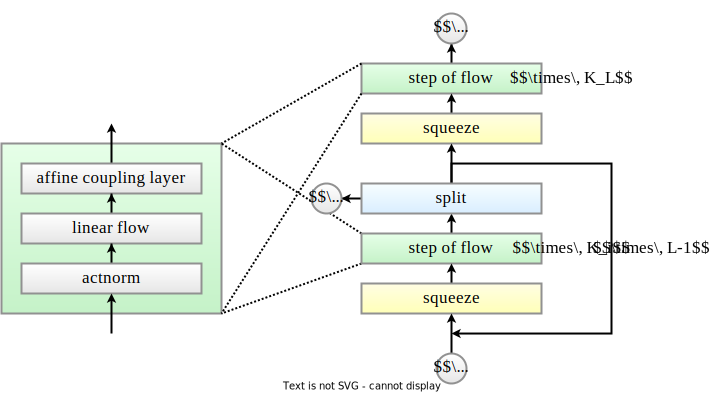

#### Discrete Smooth Transforms

The design of the smooth transforms can be quite complex, requiring careful engineering to ensure they remain invertible and differentiable. In this section, we discuss some of the most important smooth transforms found in application.

##### Autoregressive flow

> Huang, C., Krueger, D., Lacoste, A., & Courville, A.C. (2018). Neural Autoregressive Flows. *ArXiv, abs/1804.00779*.

Autoregressive flow is one of the basic ways to construct a **smooth** function $f \in C^1(\R^d \to \R^d)$.

- Let $\p{h_i(x_{<i})}_{i = 1}^{d} \in D(\R^{i - 1} \to \R^m)$  be a sequence of differentiable functions.
- Let $\tau(x, h) \in D(\R \times \R^m \to \R)$ be a function smooth in $x$ and differentiable in $h$.

Then $f_i(x) = \tau(x_{i}, h_i(x_{<i}))$ for all $i \in \c{1, \ldots, n}$ gives a smooth function, called an autoregressive flow.

The Jacobian matrix of $f$ is a $\R^{d \times d}$ matrix:
$$
f'(x)=\left[\begin{array}{cccc}
\frac{\partial f_1}{\partial x_1} & \frac{\partial f_1}{\partial x_2} & \cdots & \frac{\partial f_1}{\partial x_d} \\
\frac{\partial x_2}{\partial x_1} & \frac{\partial f_2}{\partial x_2} & \cdots & \frac{\partial f_2}{\partial x_d} \\
\vdots & \vdots & \ddots & \vdots \\
\frac{\partial f_d}{\partial x_1} & \frac{\partial f_d}{\partial x_2} & \cdots & \frac{\partial f_d}{\partial x_d}
\end{array}\right]
$$
For the diagonal elements, we have:
$$
\frac{\partial f_i}{\partial x_i}=\frac{\partial \tau\left(x_i, h_i\left(x_{<i}\right)\right)}{\partial x_i}
$$
For elements in the lower triangular matrix, we have:
$$
\frac{\partial f_i}{\partial x_j}=\frac{\partial \tau\left(x_i, h_i\left(x_{<i}\right)\right)}{\partial x_j}=\frac{\partial \tau\left(x_i, h_i\left(x_{<i}\right)\right)}{\partial h_i\left(x_{<i}\right)} \cdot \frac{\partial h_i\left(x_{<i}\right)}{\partial x_j}
$$
Putting it all together, the triangular Jacobian matrix of the autoregressive flow is:
$$
f'(x)=\left[\begin{array}{cccc}
\frac{\partial \tau\p{x_1, h_1()}}{\partial x_1} & 0 & \cdots & 0 \\
\frac{\partial \tau\p{x_2, h_2\p{x_1}}}{\partial h_2\p{x_1}} \cdot \frac{\partial h_2\p{x_1}}{\partial x_1} & \frac{\partial \tau\p{x_2, h_2\p{x_1}}}{\partial x_2} & \cdots & 0 \\
\vdots & \vdots & \ddots & \vdots \\
\frac{\partial \tau\p{x_d h_d\p{x_{<d}}}}{\partial h_d\p{x_{<d}}} \cdot \frac{\partial h_d\p{x_{<d}}}{\partial x_1} & \frac{\partial \tau\p{x_d h_d\p{x_{<d}}}}{\partial h_d\p{x_{<d}}} \cdot \frac{\partial h_d\p{x_{<d}}}{\partial x_2} & \cdots & \frac{\partial \tau\p{x_d, h_d\p{x_{<d}}}}{\partial x_d}
\end{array}\right]
$$
And the log absolute determinant is given by:
$$
\log \left|\det f'(x)\right|=\sum_{i=1}^d \log \left|\frac{\partial \tau\left(x_i, h_i\left(x_{<i}\right)\right)}{\partial x_i}\right|
$$
Autoregressive flows are computationally asymmetric.

- Computing $f(x)$ and $\log \abs{\det f'(x)}$ is efficient, since $(h_i)_{i = 1}^n$ can be computed in parallel.
- Computing $f^{-1}(y)$ and $\log \abs{\det J_{f^{-1}}(y)}$is slow, since it is autoregressive.
  - In this case, we must sequentially compute $x_i$ from $y_i$ using the relation $x_i = \tau^{-1}(y_i, h_i(x_{<i}))$.
  - We start from $x_1 = \tau^{-1}(y_1, h_1())$ and proceed sequentially.

##### Coupling layer

> Dinh, L., Krueger, D., & Bengio, Y. (2014). NICE: Non-linear Independent Components Estimation. *CoRR, abs/1410.8516*.

A coupling layer is another way of building a **smooth** function $f \in C^1(\R^d \to \R^d)$.

- Let $h(x_{\le p}) \in D(\R^p \to \R^m)$ be a differentiable function.
- Let $\tau(x_{> p}, h) \in D(\R^{d - p} \times \R^m \to \R^{d - p})$ be a function smooth in $x$ and differentiable in $h$.

Then $f(x) = f(x_{\le p}, x_{>p}) = \s{x_{ \le p}, \tau(x, h(x_{>p}))}$ gives a smooth function, called a **coupling layer**. And the Jacobian is given by
$$
J_f = \begin{bmatrix}
\I_{p} & \O \\
{\partial \tau}/{\partial x_{\le p}} & {\partial \tau}/{\partial x_{> p}}
\end{bmatrix}
$$

- $\I_p \in \R^{p \times p}$ is an identity matrix and $\O = 0^{p \times (d - p)}$ is a zero matrix.

- The other two matrices are obtained using the chain rule:
  $$
  \frac{\partial \tau}{\partial x_{\le p}} = \frac{\partial \tau}{\partial h} \frac{\partial h}{\partial x_{\le p}} = J_\tau[:, 1:p] \cdot J_h,\quad \frac{\partial \tau}{\partial x_{\ge p}} = J_\tau[:, (p + 1):d].
  $$

- The log determinant of the coupling layer is determined by $\part \tau / \part x_{> p}$.
  $$
  \log \operatorname{det} J_f=\log \left(\operatorname{det}{\I}_p \cdot \operatorname{det} \partial \tau / \partial x_{>p}\right)=\log \left(\operatorname{det} \partial \tau / \partial x_{>p}\right)
  $$

Coupling layers are symmetric in structure.

- $h(x_{\le p})$ must be evaluated on both the forward and reverse transform.
- The forward and reverse map have time complexity determined by transform $\tau$ and $\tau^{-1}$.

##### Linear flows

> Papamakarios, G., Nalisnick, E.T., Jimenez Rezende, D., Mohamed, S., & Lakshminarayanan, B. (2019). Normalizing Flows for Probabilistic Modeling and Inference. *J. Mach. Learn. Res., 22*, 57:1-57:64.

The ordering of dimensions in $x \in \R^d$ influence both the autoregressive flow and the coupling layer. Thus flow models in practice often contains linear flows to rotate and stretch $x$ in $\R^d$ for better performance.

Suppose $W \in \R^{d \times d}$ is an invertible matrix. $f(x) \in C^\infty(\R^d \to \R^d)$ where $f(x) = Wx$ is a smooth function.

A straightforward implementation is to directly parameterize the matrix $W$, and learn the flow with gradient-based optimizers. This is not optimal because $W$ may become singular during training, and computing $W^{-1}$ and $\det W$ both have $O(d^3)$ time complexity in general.

Ideas from matrix decompositions leads to better parameterizations of the matrix $W$ with better stability and computational efficiency. For example, we could apply PLU decomposition for parameterization as following:

- First sample an invertible matrix $W \in \R^{d \times d}$. In practice we use a random rotation matrix with orthonormal columns and $\det W = 1$.
- Then decompose $W$ into $W = P L U$ where $P \in \R^{d \times d}$ is a permutation matrix, $L$ is a lower triangular matrix with all elements on the diagonal being one. And $U$ is an upper diagonal matrix.
- Now we fix matrix $P$, and view $L$ and $U$ as trainable parameters.
- In this case $\log \abs{\det W} = \log \abs{\det U} = \sum_{k = 1}^d \log \abs{e_k^T U e_k}$. Which takes only $O(d)$ time to compute.

##### Normalization layers

> Kingma, D.P., & Dhariwal, P. (2018). Glow: Generative Flow with Invertible 1x1 Convolutions. *ArXiv, abs/1807.03039*.

The so-called ActNorm is proposed in Glow as an alternative for Batch Normalization in flow models.

Consider $f(x) = (x - \mu) / (\sigma + \epsilon) \in C^\infty(\R^d \to \R^d)$. Where $\mu, \sigma \in \R^d$ and $\epsilon > 0$ is a small positive constant, and the division is applied pointwise.

- First we initialize the mean $\mu$ and variance $\sigma$ with the first batch during the first forward pass.
- Then we view them trainable parameters during the rest of the training process.
- Clearly $\log \abs{\det f(x)} = -\sum_{k = 1}^d \log (\sigma_k + \epsilon)$.

##### Multi-scale architectures

> Dinh, L., Sohl-Dickstein, J.N., & Bengio, S. (2016). Density estimation using Real NVP. *ArXiv, abs/1605.08803*.

A flow model must have an input and an output of the same dimensionality. However hierarchical structures are often found beneficial in generative modeling of high dimensional data such as images and audios.

One possible methods of incorporating hierarchical architectures with flows is the following:

- Consider a sequence modeling scenario, where $x \in \R^{n \times d}$, where $n$ is a multiple of integer $k \ge 2$.
- We could **reshape** $x \in \R^{n \times d}$ into $y \in \R^{n/k\times kd}$.
  - Where $y[m] = \operatorname{concat}\p{x[km],\ldots, x[km + k - 1]} \in \R^{kd}$.

- We could also **split** $x \in \R^{n \times d}$ into $y, z$ and stop applying more transformation on $z$ to save computation.
  - For example, let $x = \operatorname{concat}(y, z)$ where $y, z \in \R^{n \times d / 2}$.

##### Glow

> Kingma, D.P., & Dhariwal, P. (2018). Glow: Generative Flow with Invertible 1x1 Convolutions. *ArXiv, abs/1807.03039*.
>

We have already introduced all of the flow components applied in Glow, which is one of the most successful flow models found in application. In the following, we describe the architecture when applied to sequence modeling.

- Suppose $\mathbf x = \mathbf z_0 \in \R^{n \times d}$ follows the data distribution $p_*(\mathbf x)$.
- The Glow model contains $L$ stacks of flows. In each stack $i \in \c{1, \ldots, L}$,
  - We first squeeze $\mathbf x_{i - 1}$ in time into $\mathbf a_{i}$.
  - Then apply a series of flow steps on $\mathbf a_i$ to obtain $\mathbf b_i$.
  - Finally, we could split $\mathbf b_i = \operatorname{concat}(\mathbf z_i, \mathbf x_i)$. $\mathbf x_i$ is further transformed down the Glow model while $\mathbf z_i$ is left out.

To sample from the Glow model, first sample $\mathbf z = (\mathbf z_1, \ldots, \mathbf z_L)$ from prior density $p(\mathbf z)$. Then apply the reverse transform.

