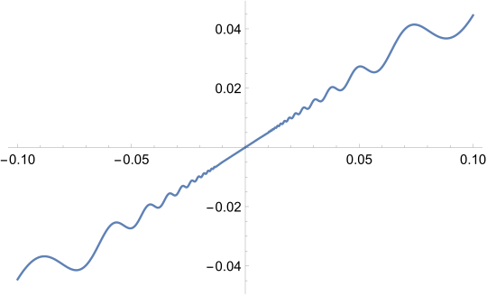
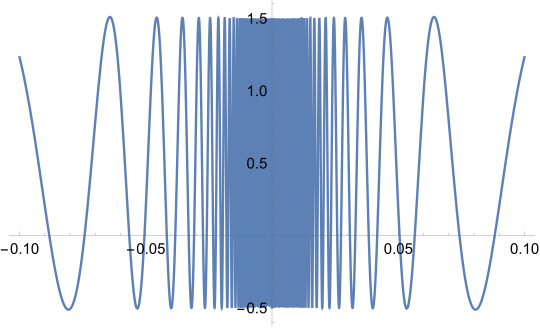

#### Inverse Function Theorem

> (**Differentiability does not imply locally invertibility**)
>
> Consider function the following function and its derivative.
>
> | $f(x) = (x/2 + x^2 \sin(1/x))1_{x\neq 0}$                    | $f'(x) = 1/2 + (2x\sin(1/x) - \sin(1/x))1_{x\neq 0}$         |
> | ------------------------------------------------------------ | ------------------------------------------------------------ |
> |  |  |
>
> For all $r > 0$, $f$ is not monotonic in $(-r, r)$. $f'(0) = 1/2$.
>
> Notice that $f'(0) > 0$, however $f(x)$ is not "locally" invertible around $x=0$.
>
> The **inverse function theorem** basically says we need to additionally require $f'(x)$ to be continuous in some ball around $0$.

##### Inverse Function Theorem

Suppose $f: S \subseteq \R^n \to \R^n$ where $S$ is open, and $f \in C^1[S]$.

For $a \in S$, where $Df(a)$ is nonsingular. There exists $X\subseteq S$ an open neighborhood of $a$, and $Y = f[X]$, such that

- $f|_X$ is injective. $f|_X$ has inverse $g = \left (f|_X\right)^{-1}: Y \to X$.
- $g \in C^1[Y]$ and $Dg(v) = Df(g(v))^{-1}$.

Proof:
- W.L.O.G. assume $a = 0$ and $f(a) = 0$.
    - This can be done with defining $f_1(x) = f(x + a) - f(a)$.
- W.L.O.G. assume $Df(0) = I$.
    - This can be done with defining $f_2(x) = f'(0)^{-1}f_1(x)$.
- Define $\phi(x) = x - f(x)$, and $\phi_y(x) = \phi(x) + y$.
- Similar to MVT, $\n{\phi(s) - \phi(t)} \le \max_{u \in [s, t]}\n{\phi'(u)}\n{s - t}$ for $s, t \in S$.
- Take $r > 0$ small enough such that the following are true:
    - $\forall u \in \bar B(0, r) \cap S: \n{\phi'(u)} \le 1/2$.
        - Since $f \in C^1[S]$, we have $\phi, \phi_y \in C^1[S]$.
        - And that $\n{\phi'(0)} = 0$.
    - $\bar B(0, r) \subset S$.
    - $\forall u \in \bar B(0, r): \det(f'(u)) \neq 0$.
- $\phi_y$ is a contractive mapping on $S=\bar B(0, r)$ when $\n{y} < r/2$.
    - $\phi_y[S] \subseteq S$ since $\n{\phi_y(s)} < \n{s}/2 + r/2 \le r$ for $s \in \bar B(0, r)$.
    - $\n{\phi_y(s) - \phi_y(t)} = \n{\phi(s) - \phi(t)} \le 1/2\n{s - t}$ for $s, t \in \bar B(0, r)$.
    - $S$ is clearly a complete metric space.
- $\phi_y$ has unique fixed point $x \in S$.
- There is a unique $x \in S$ s.t. $f(x) = y$ by definition of $\phi_y$.
- Define $Y = B(0, r/2)$, $X = f^{-1}[Y] \cap B(0, r)$. Q.E.D.
    - $X, Y$ are open sets. $0 \in X$ and $0 \in Y$.
    - $f|_X:X \to Y$ is bijective.
    - $g$ is Lipschitz continuous on $Y$.
        - $\n{s - t} - \n{f(s) - f(t)}\le \n{\phi(s) - \phi(t)} \le 1/2\n{s - t}$ for $s, t \in X$.
        - $\n{g(u) - g(v)} \le 2 \n{u - v}$ for $u, v \in Y$.
    - $f$ is Lipschitz continuous on $X$.
        - By construction $\n{f'(u)} + 1 \le \n{I - f'(u)} \le 1/2$ for $u \in \bar B(0, r)$.
    - Suppose $g$ is differentiable at $v \in Y$, then $Dg(v) = (Df(g(v)))^{-1}$.
        - Let $u = g(v) \in X$.
        - Since $g(f(u)) = \iota$, by chain rule $Dg \circ f(u) = I = Dg(v)Df(u)$.
        - Therefore $Dg(v) = (Df(u))^{-1}$.
    - $g \in D^*[Y]$.
        - Suppose $v \in Y$, $u = g(v) \in X$, and $A = Df(u)$.
        - Suppose $h \in \R^n$, $k = g(v + h) - g(v)$.
        - Therefore $f(u + k) = v + h$, and $f(u) = v$.
        - We already know $f(u + k) = f(u) + Ak + o\n{k}$.
        - Equivalently $v + h = v + A(g(v + h) - g(v)) + o\n{h}$.
        - Equivalently $g(v+h) = g(v) + A^{-1}h + o\n{h}$.
    - $f \in C^k[X] \implies g \in C^k[Y]$.
        - Notice that $Dg(v) = (Df(g(v)))^{-1}$.
        - Matrix inverse is in $C^\infty$. ==TODO==
        - $f \in C^k \iff Df \in C^{k-1}$.
        - Start from $g \in C[Y]$, with induction, $g \in C^k[Y]$.

#### Implicit Function Theorem

> Consider $F(x, y) = (x^2 + y^2)$, $F(x, y) = 0$ defines a circle on $\R^2$.
>
> When is $y$ "locally" a function of $x$?

##### Implicit Function Theorem

Suppose $F:  U \subseteq \R^{n} \times \R^m \to \R^m$ for open set $U$ and $F \in C^1[U]$. Consider zero level set $M = F^{-1}\c{0}$.

Define notation $\part F / \part y = (\part F_i / \part y_j)$.
- $\part F/\part x: U \to \R^{m \times n}$ and $\part F / \part y: U \to \R^{m \times m}$ is a square matrix.
- $D F = [\part F / \part x \mid \part F/ \part y]: U \to \R^{m \times (n + m)}$ is a rectangle matrix.

Suppose $(x_0, y_0) \in M$, $F(x_0, y_0) = 0$. And $\det \left (\part F(x_0, y_0) / \part y\right) \neq 0$. We have:
- There exists open neighborhood $V \subseteq \R^n$ of $x_0$, and open neighborhood $W \subseteq \R^m$ of $y_0$.
- There exists a $\phi: V \to W$ in $C^1[V]$ s.t. $\{(x, \phi(x)): x \in V\} = M \cap (V \times W)$.
- $D \phi(x) = -\frac{\part F}{\part y}(x, \phi(x))^{-1}\frac{\part F}{\part x}(x, \phi(x))$.

The proof follows from Inverse Function Theorem
- Construct $f: U \to \R^{n} \times \R^m$ as following: $f(x, y)=[x;F\left(x, y\right)]$.
    - $Df =\left[\begin{array}{c:c} I & 0 \\ \hdashline \part F / \part x & {\partial F}/{\partial y}\end{array}\right]$, it is invertible iff $\part F / \part y$ is invertible.
- Apply Inverse Function Theorem to $f(x, y)$ at point $(x_0, y_0)$.
    - There exists open neighborhoods $S, T$ of $(x_0, y_0)$ and $(x_0, 0)$.
    - Bijection $f|_S$ has inverse $g: T\to S$.
- Now restrict $g$ on the x-axis (almost) gives the desired result:
    - Denote $Z = T \cap \{y = 0\}$ in $T$.
    - Further, bijection $f|_{S \cap M}$ has inverse $g|_{Z}$.
    - Define $\phi(x) = [g(x, 0)]_y$.
- We can reshape the neighborhood a little bit:
    - Take open rectangle neighborhood $V \times W \subset S$.
    - And restrict $\phi = \phi|_V$.
- It is clear that $\{(x, \phi(x)): x \in V\} = M \cap (V \times W)$ and $\phi \in C^1[V]$.
- We can derive $D\phi(x)$ following the definition:
    - Notice that $g(x, 0) = [x; \phi(x)]$.
    - Therefore $Dg(x, 0) = Df(x, \phi(x))^{-1}= \left[\begin{array}{c:c} I & 0 \\ \hdashline -\left(\frac{\part F}{\part y}\right)^{-1}\frac{\part F}{\part x} & \frac{\partial F}{\partial y}^{-1}\end{array}\right]$.
    - Observe the matrix, $D \phi(x) = -\frac{\part F}{\part y}(x, \phi(x))^{-1}\frac{\part F}{\part x}(x, \phi(x))$.
