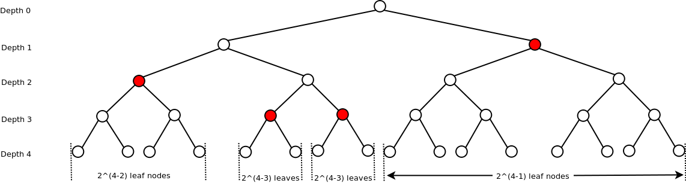
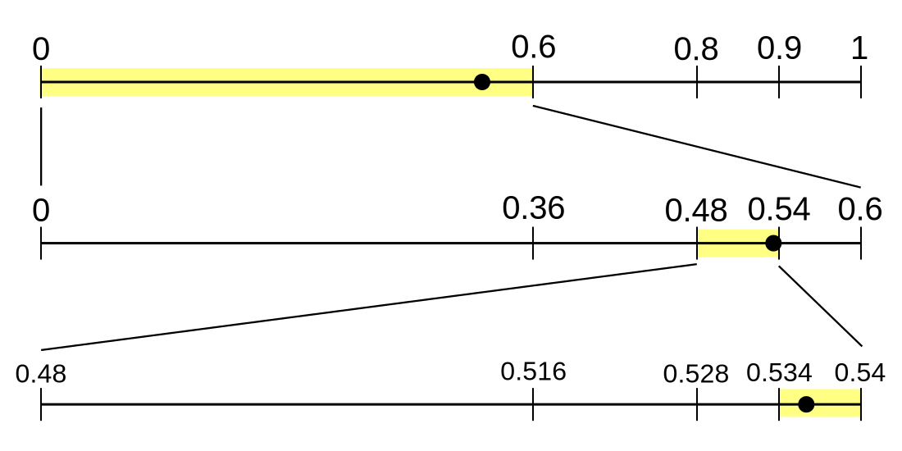

##### Problem: Encoding Bernoulli process

Consider encoding a Bernoulli process $X_n, n \ge 1$, $X_n \sim \operatorname{Bernoulli}(p)$. The entropy of each symbol is $H(p) \le 1$, but the  expected code length must be $L = 1$. What is happening?

##### Review: Real expansion theorem

$\{0, 1, \cdots, D-1\}^\infty$, $[0, 1) \simeq \{0, 1, \cdots, D-1\}^\infty$ by **decimal expansion** for any $D \ge 2$.

Finite decimals $\leftrightarrow$ finite codewords. The set of all finite codewords is $\{0, \cdots, D-1\}^*$.

Define the interval of $a_1\cdots a_n$ and $0.a_1a_2\cdots a_n = x$ as $I_{a_1\cdots a_n} = [x, x + D^{-n})$.

Finite codeword $x$ is the prefix of $y$ if and only if $y \in I_x$.

#### Source Coding Theory

##### Source code

 Suppose $\mathcal X$ is a countable **source alphabet**. Suppose $\mathcal D$ is the **code alphabet** with size $D$. $\mathcal D^*$ is the set of all finite length strings of symbols from $\mathcal D$.

An function $C: \mathcal X \to \mathcal D^*$ is called a $D$-ary **source code**.

- For $x \in \mathcal X$, $l_C(x): =|C(x)|$ is the **code length** of the code of $x$.
- $C[\mathcal X]$ is called the set of **codewords**.
- $C$ that is not injective is called **singular**. Otherwise it is **non-singular**.
- $C$ is called a **prefix code / instantaneous code** if no codeword is the prefix of another.

Suppose $a, b \in \mathcal X$, $C(a)C(b)$ is the **concatenation of string** $C(a)$ and $C(b)$. 

The extensions of $C$, $C^m: \mathcal X^m \to \mathcal D^{*}$ and $C^*: \mathcal X^* \to \mathcal D^*$ is defined by **concatenation**.

- $C$ is called **uniquely decodable** if $C^*$ is non-singular. Certainly $C^m$ is also non-singular.
  - A prefix code is uniquely decodable.
  - A fixed-length code is a prefix code, therefore uniquely decodable.
  - There exists an algorithm to test unique decodability.

##### Expected code length

 **Expected code length / expected description length** $L_C(p)$ of a source code $C: \mathcal X \to \mathcal D^*$ for distribution $p \in \mathcal {P_X}$ and random variable $X: \Omega \to \mathcal X$ is defined:
$$
L_C(p) := \sum_{x \in \mathcal X} p(x) l_C(x); \quad L_C(X):= E[l(X)]
$$
##### Kraft inequality

 Suppose $|\mathcal X| = n$ and $|\mathcal D| = D$.
$$
\sum_{i=1}^{n} D^{-l_{i}} \leq 1 \quad (*)
$$
Consider the full $D$-ary tree $T$ with depth $l_n$. Each nodes at depth $d$ corresponds to a codeword with length $d$. A node is called **occupied** if itself or one of its ancesters is used.

Suppose $C: \mathcal X \to \mathcal D^*$ is a prefix code. Suppose the $n$ code lengths are $l_1 \le \cdots \le l_n$. Then $*$ must be true.

- On the tree $T$:
  - Suppose a codeword of length $l_i$ is taken, all $D^{l_n - l_i}$ leaf nodes are occupied.
  - Since $C$ is a prefix code, no leaf node has more than one ancestors.
- Suppose $*$ is not true, and $\sum_{i = 1}^n D^{l_n - l_i} > D^{l_n}$, no leaf nodes can be used. This is a contradiction!

Given code lengths $l_1 \le \cdots \le l_n$ satisfying $*$, there exists a prefix code $C: \mathcal X \to \mathcal D^*$, constructed by:

- Pick short codewords first.
- Pick any unoccupied node on depth $l_i$.
  - This is always possible, otherwise $\sum_{k = 1}^{i-1} D^{l_i - l_k} \ge 1$, and this is not possible.

##### Countable Kraft Inequality

 Suppose $\mathcal X$ is countably infinite and $|\mathcal D| = D$.

w.l.o.g. assume $\mathcal D \simeq \{0, 1, \cdots, D - 1\}$. $\mathcal X \simeq \N^+$.
$$
\sum_{i = 1}^\infty D^{-l_i} \leq 1 \quad (*)
$$
Suppose $C: \mathcal X \to \mathcal D^*$ is a prefix code with code $C_i$ and lengths $l_i$, then $*$ is true. Just consider the sum of all the length of intervals corresponds to code words:
$$
\sum_{i = 1}^\infty D^{-l_i} = \sum_{i = 1}^\infty |[C_i, C_i + D^{-l_i})| \le 1
$$
Conversely, given a set of code lengths $l_1, l_2, \cdots$, we **can rearrange** it into increasing sequence that satisfies $*$. Then we can construct prefix code tree in the same way as in the proof of finite Kraft Inequality.

##### McMillan Inequality

 Suppose $|\mathcal X| = n$. Suppose $\mathcal D$ is of size $D$.

Suppose $C: \mathcal X \to \mathcal D^*$ is a **uniquely decodable** code. Suppose the code lengths are $l_1 \le \cdots \le l_n$. Then $*$ must be true.

For any $m > 1$. Consider the extension $C^m: \mathcal X^m \to \mathcal D^*$. Consider the full $D$-ary tree $T_m$ with depth $l_nm$. Each nodes at depth $d$ corresponds to a codeword with length $d$. Assign weight $D^{-l}$ to nodes at depth $l$.

Notice that $(\sum D^{-l_i})^m$ happens to be the sum of all weights:
$$
\left ( \sum_{i = 1}^n D^{-l_i} \right)^m = \sum_{i_{1}=1}^{n} \sum_{i_{2}=1}^{n} \cdots \sum_{i_{m}=1}^{n} D^{-\left(l_{i_{1}}+l_{i_{2}}+\cdots+l_{i_{m}}\right)} = \sum_{l = 1}^{ml_n} q_l D^{-l} \le \sum_{l = 1}^{ml_n} D^l D^{-l} =  ml_n
$$
Where $q_l$ is the number of codewords in $C^m[\mathcal X^m]$ with length $l$. Since $C^m$ is uniquely decodable. $q_l \le D^l$.
$$
\sum_{i = 1}^ n D^{-l_i} \le (m l_n)^{1/m} \to 1 \quad \text{ as } m \to \infty
$$
##### Extended McMillan inequality

 Suppose $\mathcal X$ is countably infinite and $|\mathcal D| = D$.

Suppose $C: \mathcal X \to \mathcal D^*$ is a uniquely decodable code. Then the restriction of $C$ on any finite subset of $\mathcal X$ is also uniquely decodable. Therefore
$$
\sum_{x \in \mathcal X} D^{-l(x)} \le 1
$$

#### Entropy Bound

##### D-adic distribution

 A probability distribution $p(x) \in \mathcal{P_X}$ where $\forall x \in \mathcal X: p(x) = D^{-t_x}, t_x \in \N$ is called a $D$-adic distribution. When $D = 2$, $2$-adic is also called dyadic.

##### Entropy bound

 Suppose $C: \mathcal X \to \mathcal D^*$ is a $D$-ary **uniquely decodable** code. Suppose $p(x) \in \mathcal {P_X}$.

By definitions, we know that:
$$
L_C(p) = \sum_{x \in \mathcal X} p(x) l(x); \quad H_D(p) = - \sum_{x \in \mathcal X} p(x) \log_D \frac{1}{p(x)};\\
$$
The **redundancy** of $D$-ary uniquely decodable code $C$ for distribution $p$, denoted by $R_C(p)$ is:
$$
\begin{aligned}
R_C(p) = L_C(p) - H_D(p) & = \sum_{x \in \mathcal X} p(x) \log_D(D^{l(x)} p(x))\\
& \ge \sum_{x \in \mathcal X} \frac{p(x)}{\ln D} \left (1 - \frac{1}{p(x) D^{l(x)}} \right)\\
& = \sum_{x \in \mathcal X} \frac{1}{\ln D} (p(x) - D^{-l(x)}) = 0
\end{aligned}
$$

- with equality if and only if when $p(x) > 0$, $p(x) = D^{-l(x)}$.
  - That is, $p(x) \in \mathcal{P_X}$ is $D$-adic.
- On the other hand, suppose $p(x) \in \mathcal{P_X}$ is $D$-adic.
  - Define $l(x) = - \log_D p(x)$.
  - Then $\sum_{x \in \mathcal X} D^{-l(x)} = 1$.
  - There exists a $D$-ary **prefix code** $C$ where the expected code length $L_C(p) = H_D(p)$.

##### Shannon Code

 Suppose $\mathcal X$ is countable and $|\mathcal D| = D$. Suppose $p(x) \in \mathcal{P_X}$. Define the code length:
$$
l(x) := \lceil -\log_D p(x) \rceil \ge - \log_D p(x) \implies D^{-l(x)} \le p(x) \implies \sum_{x \in \mathcal X} D^{-l(x)} \le 1
$$
Then construct a prefix code $C: \mathcal X \to \mathcal D^*$. We have the following bound:
$$
L_C(p) = \sum_{x \in \mathcal X} p(x) l(x) \le \sum_{x \in \mathcal X}p(x) (1 - \log_D p(x)) = 1 + H_D(p); \quad R_C(p) \le 1
$$
##### Optimal code and minimum description length

 Suppose $p \in \mathcal {P_X}$.

The **optimal code** is the code $C: \mathcal X \to \mathcal D^*$ that minimizes $L_C(p)$.

The expected code length of $C$ is called the **minimum description length** of $p$, denoted by $L^*(p)$.

Similarly we can define $L^*(X)$ for random variables.

##### Bound of minimum description length

 Shannon code provides a bound for the MDI:
$$
H_D(p) \le L^*(p) \le H_D(p) + 1
$$
##### MDI per symbol in random processes

 Suppose $X_n, n \ge 1$ is a discrete state discrete time random process with countable alphabet $\mathcal X$.

The optimal description length $L^*(X_1, \cdots, X_n)$ is bounded by:
$$
H_D(X_1, \cdots, X_n) \le L^*(X_1, \cdots, X_n) \le H_D(X_1, \cdots, X_n) + 1
$$
Define $L^*_n = L^*(X_1, \cdots, X_n) / n$ as the **expected minimum description length per symbol**. $L_n^* \to H_X$ if the limit exists. And the estimation margin $1/n$ goes to zero.

#### Arithemetic Code

Suppose $\mathcal X$ is countable and **linearly ordered**. Suppose $p(x) \in \mathcal{P_X}$.

##### Shannon-Fano-Elias Code

 The encoding algorithm defines $C: \mathcal X \to \{0, 1, \cdots, D - 1\}^*$.

- Define $F(x^+) = \sum_{a \le x}p(a)$. $F(x^-) = \sum_{a < x} p(a)$.
- Define the **tag** $\overline F(x) = (F(x^+) + F(x^-))/2$.
  - But there may be other choices.

- For $x \in \mathcal X$. Choose code length $l(x) = \lceil -\log_D p(x)\rceil + 1$. 
- The **code** $C(x) = \lfloor \overline F(x) \rfloor_{l(x)}$ is the $l(x)$ most significant bits in the binary decimal expansion of $\overline F(x)$.
  - The **short code**: choose $l(x)$ to be as small as possible so that $F(\mathbf x^-) \le \lfloor \overline F( x) \rfloor_{l( x)} \le F( x^+)$.
  - The **guaranteed code**: choose $l(x) = \lceil -\log_2 p( x)\rceil + 1$.

The properties of the algorithm. Denote $R(x) = C(x) + D^{-l(x)}$:

- $D^{-(\lceil -\log_D p(x)\rceil + 1)} = D^{-l(x)} = R(x) - C(x) \le p(x) / D$.
- Furthermore $F(x^-) < C(x) \le \overline F(x) < R(x) \le F(x^+)$.
  - The code $C$ defined this way is a prefix code.

- Average code length $H_D(p(x)) + 1\le L_C(p(x)) < H_D(p(x)) + 2$.

##### Arithemetic code

 Suppose $\mathbf x = (x_1, x_2, \cdots, x_n) \in \mathcal X^n$. Define **lexicographic** linear order on $\mathcal X^n$.

The encoding algorithm defines $C: \mathcal X^n \to \{0, \cdots, D-  1\}^*$:

- $[F(\mathbf x^-), F(\mathbf x^+))$ is defined same as in Shannon-Fano-Elias Code.
- We **may** choose **tag** $\overline F(\mathbf x) = (F(\mathbf x^-) + F(\mathbf x^+))/2 \in [0, 1)$.
  - But there may be better choices. Which may leads to better codes.
- The **code** $C(\mathbf x) = \lfloor \overline F(\mathbf x) \rfloor_{l(\mathbf x)}$ is the $l(\mathbf x)$ most significant bits in the binary decimal expansion of $\overline F(\mathbf x)$.
  - The **short code**: choose $l(\mathbf x)$ to be as small as possible so that $F(\mathbf x^-) \le \lfloor \overline F(\mathbf x) \rfloor_{l(\mathbf x)} \le F(\mathbf x^+)$.
  - The **guaranteed code**: choose $l(\mathbf x) = \lceil -\log_2 p(\mathbf x)\rceil + 1$.

Notice that when using center tag, and guaranteed code, the properties are exactly the same as the SFE code:

- The code $C: \mathcal X^n \to \{0, \cdots, D-1\}^*$ is a prefix code.
- Average code length $H_D(p(\mathbf x)) + 1\le L_C(p(\mathbf x)) < H_D(p(\mathbf x)) + 2$.

Decoding / storing the code is not yet discussed here.

#### Lempel-Ziv

##### LZ77 Algorithm

 A naive implementation of LZ77 algorithm:

- Parameters:
  - $C$: A code for encoding and decoding a single symbol.
  - $O$: Length of bits to encode the offset.
  - $L$: Number of bits to encode the length.
- Encoding algorithm:
  - Inputs:
    - $s[0:N]$: Source symbol array with length $N$.
  - Store hyperparameters $O$ and $L$ in the output bit stream.
  - Let $p=0$ as the position of next byte to be encoded.
  - While $p \lt N$:
    - find the longest prefix match of $s[p:p+2^{L}-1]$ inside $s[p-2^{O}+1:p+2^{L}-1]$ of the form $s[p-k: p-k + l], k > 0$.
    - If there is a match, suppose $c$ is the next byte to be coded.
      - Code and output the tuple $(k, l, c)$.
      - $p = p + l + 1$.
    - If there is not a match
      - Code and output the tuple $(0, 0, c)$.
      - $p = p + 1$.

##### LZ78 Algorithm

 The following is a version of LZ78 with a limited size dictionary. The dictionary is freezed when all spaces are filled. The dictionary index is coded in fixed width binaries.

- Parameters:
  - $K$: the max number of bits for dictionary entries. This limits the growth of the dictionary to be at most $2^{K}$ long.
- Encoding algorithm:
  - Inputs:
    - $s[0:N]$: Source symbol array with length $N$.
  - Let $p=0$ as the position of next symbol to be encoded.
  - Let $d=\{\varnothing: 0\}$ be the initial dictionary, where a null string is given index 0.
  - While $p \lt N$:
    - Let $w$ be an empty symbol array.
    - While $w+s[p]$ is in the dictionary and $p \lt N$. $w = w + s[p]$, $p = p + 1$.
    - Code and output $(\text{index} (w), s[p])$.
    - If length of dictionary $d$ is not yet $2^K$. Add $w + s[p]$ to the dictionary, assign an index to it.

##### Run length encoding

 Run-length encoding, or RLE is a technique used to reduce the size of a **repeating** string of characters, called a **run**.
$$
1111110000111 \to (6,1), (4, 0), (3, 1) \to (110, 1), (100, 0), (011, 1) \to 110110000111
$$
The compression ratio here is $12/13$.

#### Huffman Code

Suppose $|\mathcal X| = M < \infty$ and $|\mathcal D| = D \ge 2$.

##### Huffman coding

  Suppose $p(x) \in \mathcal{P_X}$.

The **Huffman procedure** to construct a **Huffman code tree** requires $M = D + k(D - 1)$. Otherwise add $(1 - M) \bmod (D-1)$ dummy symbols with zero probabilities to $\mathcal X$.

- Initialize a forest with $M$ trees with single node. Each with weight $p(x)$.
- Pick $D$ trees with minimum weight, combine into a single tree, add it back to the forest. The new tree's weight is the sum of all $D$ trees.
- Repeat until there is only a single tree in the forest. This tree is called the **Huffman code tree**.

##### Optimal uniquely decodable code

 For any $p \in \mathcal {P_X}$, there exists a **optimal prefix** code $C: \mathcal X \to \mathcal D^*$ such that:

- $\forall a, b \in \mathcal X: p(a) > p(b) \land l(a) \le  l(b)$.
  - Otherwise, swap the code for $a$ and $b$ gives a better code.
- The two longest codewords have the same length.

##### Optimality of Huffman coding, TODO

 Huffman code is an **optimal code**.
$$
H_D(p) \le L_{\operatorname{Huff}}(p) \le L_{\operatorname{Shannon}}(p) \le H_D(p) + 1
$$

#### Redundancy of Prefix Codes

Suppose $|\mathcal X| = M$. Suppose $p \in \mathcal {P_X}$, with probability $p_1, \cdots, p_M$. Suppose $\mathcal D = \{0, 1, \cdots, D - 1\}$.

Suppose $C: \mathcal X \to \mathcal D^*$ is a prefix code, it corresponds to a $D$-ary tree with $M$ leaves.

For $1 \le i \le M$, leaf node $i$ corresponds to:

- **Weight** $p_i$.
- **Depth** $l_i$. $1 \le l_i \le l_\max$.

For $1 \le k \le N$, internal node $k$ corresponds to:

- **Weight** $q_k$: The sum of probability of its leaf nodes. 
- **Depth** $d_i$. 
- **Branching probability**: for $0 \le j < D$ define $p_{k, j}$ as the weight of its $j$-th children.
- **Conditional branching distribution**: for $0 \le j < D$, $p_{k, j} / q_k$.
- **Conditional entropy**: $h_k: = H_D(p_{k, 0}/q_k, \cdots , p_{k, D-1}/q_k)$.

##### Entropy of internal nodes and total entropy

Suppose $X: \Omega \to \mathcal X$ is a random variable on $(\Omega, \mathcal F, P)$ with PMF $p$.

Then $C(X)$ is a random variable with values in $\mathcal D^{l_\max}$.

For $1 \le l \le l_\max$ define $C_l$ as the $l$-th character of string $C(X)$.

When $l > |C(X)|$ define $C_l$ to be $N \notin \mathcal D$. (Their values does not matter.)
$$
H(X) = H(X | C(X)) + H(C(X)) = H(C(X)) = H(C_1) + H(C_2 | C_1) + \cdots + H(C_{l_\max} | C_{< l_\max})
$$
Now consider a single term on the RHS: $H(C_n | C_{< n})$:
$$
H(C_n | C_{< n}) = \sum_{c_{<n} \in \mathcal D^{k-1}} H(C_n| C_{1} = c_1, \cdots, C_{n - 1} = c_{n - 1}) p(c_1, \cdots, c_{n-1})
$$

- $p(c_1, \cdots, c_{n -1}) > 0$ implies the code $c_1c_2\cdots c_{n - 1}$ corresponds to some node on the tree.
- $H(C_n | C_1 = c_1, \cdots, C_{n - 1} = c_{n - 1})> 0$ implies the node is internal!

A positive term corresponds to $q_k h_k$ for some $1 \le k \le N$. Where $q_k = p(c_1, \cdots, c_{n - 1})$, and $H(C_n | \cdots) = h_k$.
$$
H(C_n | C_{< n}) = \sum_{k \in \text{internal nodes of depth } n-1} q_k h_k; \quad H(X) = \sum_{k = 1}^N q_k h_k
$$
Notice that
$$
l(X) = |C(X)| = \sum_{l = 1}^{l_\max} 1(C_l \in \mathcal D) \implies E[l(X)] = \sum_{l =1}^{l_\max} E[1(C_l \in \mathcal D)] = \sum_{l = 1}^{l_\max} P(C_l \in \mathcal D)
$$
Further notice that:
$$
P(C_l \in \mathcal D) = \sum_{c_1, \cdots, c_{l - 1} \in \mathcal D} \sum_{c_l \in \mathcal D} p(c_1, \cdots, c_{l - 1}, c_l) = \sum_{k \in \text{internal nodes of depth }l-1} q_k
$$
Therefore we have the expected code length and redundancy:
$$
L_C(X) = \sum_{k = 1}^N q_k; \quad R_C(X) = L_C(X) - H_D(X) = \sum_{k = 1}^N q_k(1 - h_k)
$$
